<div align="center">
    
</div>


<div align="center">
    
</div>


# <div align="center">Fresenius Demo and Workshop repository</div>

This repository contains workshop content for Fresenius to be held on Sept 19th and 20th in Waltham, MA. Content with the lab instructions and hands-on guide will be updated before the workshop. Please see below for the details of the workshop and agenda: 

## Introduction

Today’s modern customers value an end-to-end real-time experience. Businesses that are able to deliver real-time, personalized experiences need to be connected and fueled at all times by a constant supply of real-time event streams and continuous real-time processing. They need access to data in motion.

We welcome you to join the Confluent team in a workshop to get started with data in motion. Each session includes a virtual guided workshop on how you can use Confluent Cloud to explore event-driven architectures and how these measured and well-informed architectural decisions result in successful outcomes. 

This workshop is perfect for those looking to get started with Confluent Cloud and build the foundation of your use case with our experienced engineers. 

## Address: 
930 Winter St, Waltham, MA 02451

## Workshop Agenda - Day 1:

| Topic | Time (GMT+1) | Speaker |
| --- | --- | --- |
| Workshop Kickoff | 10:00 - 10:30 |  |
| Get the Prerequisites Installed |  10:30 - 10:45  | Anil Dosapati / Ravi Appalla - Confluent |
| Confluent Introduction and Hands-on <br/> Workshop Demo |  10:45 - 12:30  | Anil Dosapati and Ravi Appalla - Confluent |
| Lunch |  12:30 - 1:30  | Will be coordinated by Confluent Team |
| Workshop Environment setup |  1:30 - 1:45  | Andriy Kalashnykov - FMC|
| Hands-on Workshop |  1:45 - 3:00  | Anil Dosapati |
| POC Success Criteria |  3:00 - 3:30  | Radu Craioveanu - FMC |
| Wrap-up and Next steps |  3:30 - 4:00  |  |
| Team Dinner |  TBD | TBD |

 


## Workshop Agenda - Day 2:

| Topic | Time | Speaker |
| --- | --- | --- |
| MVP Evaluation Roadmap |  10:00 - 11:00  |  FMC Team  |
| Confluent Cloud vs Event Hubs |  11:00 - 12:00  |  Shubha Vijayasarathy - Confluent (Remote)  |
| Lunch |  12:00 - 1:00  | Will be coordinated by Confluent Team |
| Value Assessment Review TCO Pricing Model |  1:00 - 2:00  |  Anita Chen/Nate Kolodny - Confluent  |
| Break |  2:00 - 2:15  |  |
| Data Streaming for IoT in HealthCare |  2:15 - 3:15  | Pete Monica - Confluent |
| Q&A and Workshop wrap-up |  3:15 - 3:45  | Nate Kolodny/Anil Dosapati - Confluent |


## Topics Covered in the Demo and Workshop:
1. [Log into Confluent Cloud](#step-1)
2. [Create an Environment and Cluster](#step-2)
3. [Create Topics and walk through Confluent Cloud Dashboard](#step-3)
4. [Create an API Key Pair](#step-4)
5. [Create Datagen Connectors for Users and Stocks](#step-5)
6. [Create ksqlDB Application](#step-6)
7. [Create a Stream and a Table](#step-7)
8. [Stream Governance](#step-8)
9. [Cloud ETL Example](#step-9)
10. [Observability and Monitoring](#step-10)
11. [Clean Up Resources](#step-11)
12. [Confluent Resources and Further Testing](#step-12)

***

## **Prerequisites**
<br>

1. Create a Confluent Cloud Account.
    - Please make sure that you are able to successfully login to Confluent Cloud before the workshop.
> **Note:** You will create resources during this workshop that will incur costs. Please make sure that you monitor resource usage to stay within the credits offered for this workshop and POC evaluation. 
2. Install confluent cli on the work machine
    - follow the steps here to install the CLI: https://docs.confluent.io/confluent-cli/current/overview.html#confluent-cli-overview 
3. Install confluent_kafka library (optional)
    - https://docs.confluent.io/kafka-clients/python/current/overview.html#ak-python

## <a name="step-1"></a>Log into Confluent Cloud

1. Log into [Confluent Cloud](https://confluent.cloud) and enter your email and password.

<div align="center" padding=25px>
    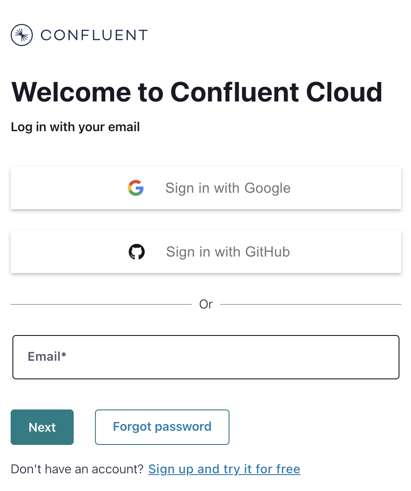
</div>

2. If you are logging in for the first time, you will see a self-guided wizard that walks you through spinning up a cluster. Please minimize this as you will walk through those steps in this workshop. 

***

## <a name="step-2"></a>Create an Environment and Cluster

An environment contains clusters and its deployed components such as Connectors, ksqlDB, and Schema Registry. You have the ability to create different environments based on your company's requirements. For example, you can use environments to separate Development/Testing, Pre-Production, and Production clusters. 

1. Click **+ Add Environment**. Specify an **Environment Name with your Initials** and Click **Create**. 

>**Note:** There is a *default* environment ready in your account upon account creation. You can use this *default* environment for the purpose of this workshop if you do not wish to create an additional environment.

<div align="center" padding=25px>
    
</div>

2. Now that you have an environment, click **Create Cluster**. 

> **Note:** Confluent Cloud clusters are available in 3 types: Basic, Standard, and Dedicated. Basic is intended for development use cases so you will use that for the workshop. Basic clusters only support single zone availability. Standard and Dedicated clusters are intended for production use and support Multi-zone deployments. If you are interested in learning more about the different types of clusters and their associated features and limits, refer to this [documentation](https://docs.confluent.io/current/cloud/clusters/cluster-types.html).

3. Chose the **Basic** cluster type. 

<div align="center" padding=25px>
    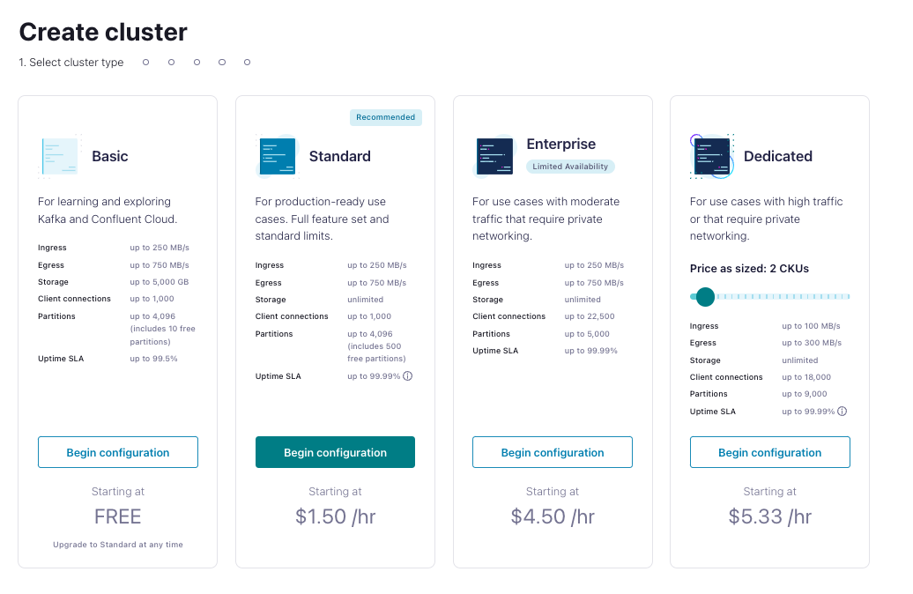
</div>

4. Click **Begin Configuration**. 
5. Choose your preferred Cloud Provider (AWS, GCP, or Azure), region, and availability zone. 
6. Specify a **Cluster Name**. For the purpose of this lab, any name will work here. 

<div align="center" padding=25px>
    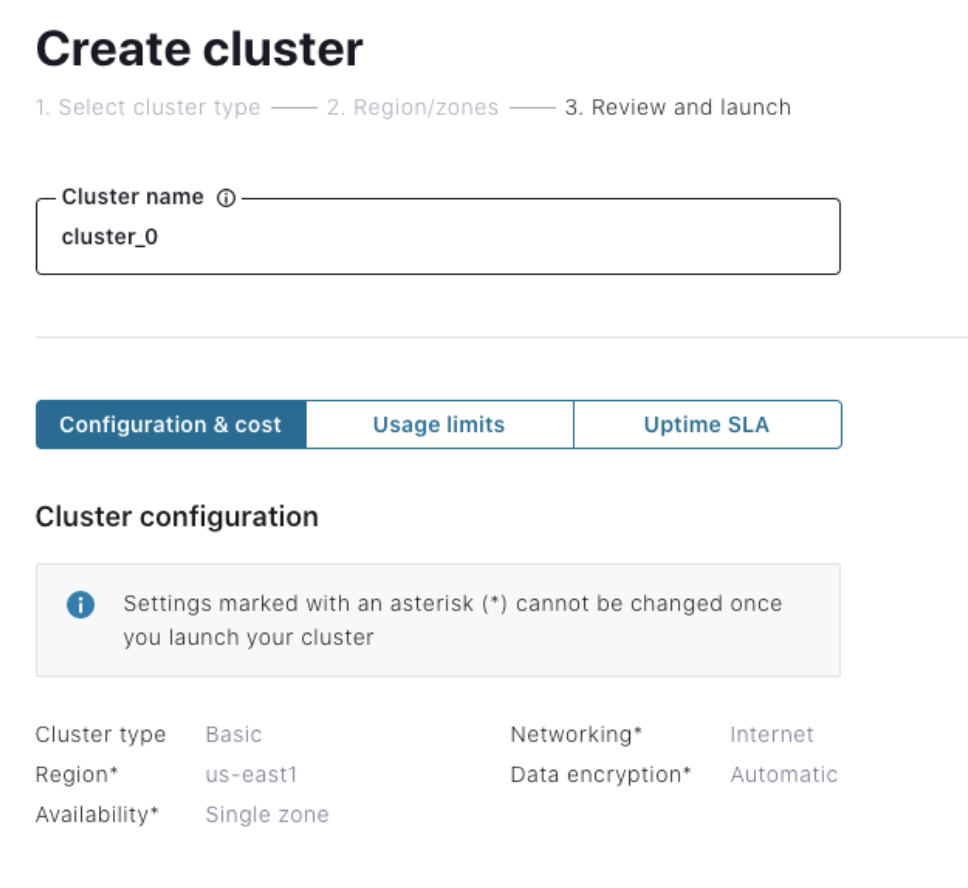
</div>

7. View the associated *Configuration & Cost*, *Usage Limits*, and *Uptime SLA* information before launching. 
8. Click **Launch Cluster**. 

***

## <a name="step-3"></a>Create Topic and Walk Through Cloud Dashboard

1. On the navigation menu, you will see **Cluster Overview**. 

> **Note:** This section shows Cluster Metrics, such as Throughput and Storage. This page also shows the number of Topics, Partitions, Connectors, and ksqlDB Applications.  Below is an example of the metrics dashboard once you have data flowing through Confluent Cloud. 

<div align="center" padding=25px>
    
</div>

2. Click on **Cluster Settings**. This is where you can find your *Cluster ID, Bootstrap Server, Cloud Details, Cluster Type,* and *Capacity Limits*.
3. On the same navigation menu, select **Topics** and click **Create Topic**. 
4. Enter **users_topic** as the topic name, **1** as the number of partitions, and then click **Create with defaults**. 

<div align="center" padding=25px>
    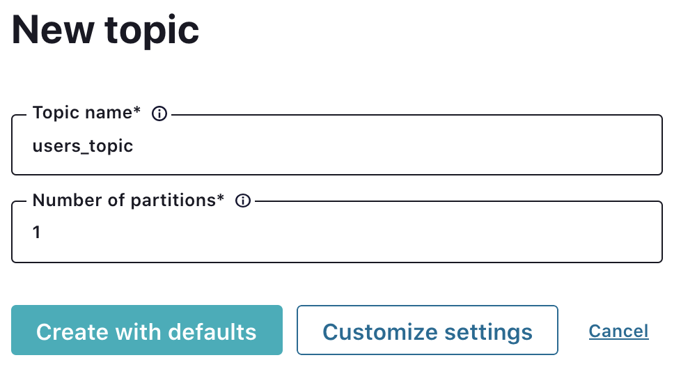
</div>

5. Repeat the previous step and create a second topic name **stocks_topic** and **1** as the number of partitions. 

> **Note:** Topics have many configurable parameters. A complete list of those configurations for Confluent Cloud can be found [here](https://docs.confluent.io/cloud/current/using/broker-config.html). If you are interested in viewing the default configurations, you can view them in the Topic Summary on the right side. 

6. After topic creation, the **Topics UI** allows you to monitor production and consumption throughput metrics and the configuration parameters for your topics. When you begin sending messages to Confluent Cloud, you will be able to view those messages and message schemas.
7. Below is a look at the topic, **users_topic**, but you need to send data to this topic before you see any metrics.

<div align="center" padding=25px>
    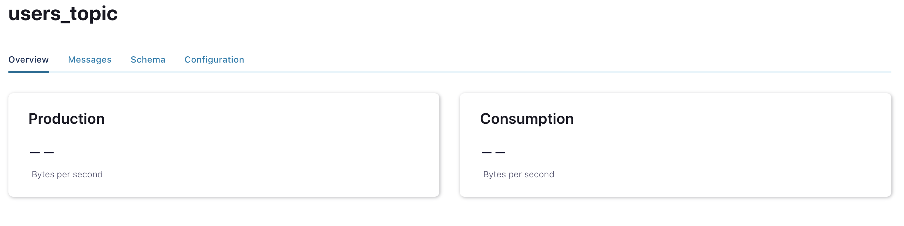
</div>

***

## <a name="step-4"></a>Create an API Key Pair

1. Select **API Access** on the navigation menu. 
2. A key pair has already been created for the ksqlDB application you created in *Step 3*. Select **+ Add Key** to create another key pair. 

<div align="center" padding=25px>
    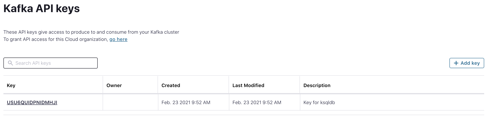
</div>

3. Select **Global Access** and then click **Next**. 
4. Copy or save your API Key and Secret somewhere. You will need these later on in the lab, you will not be able to view the secret again once you close this dialogue. 
5. After creating and saving the API key, you will see this API key in the Confluent Cloud UI in the **API Access** tab. If you don’t see the API key populate right away, refresh the browser.

***

## <a name="step-5"></a>Create Datagen Connectors for Users and Stocks

The next step is to produce sample data using the Datagen Source connector. You will create two Datagen Source connectors. One connector will send sample user data to **users_topic** and the other connector will send sample stock data to **stocks_topic**.

1. First, you will create the connector that will send data to **users_topic**. From the Confluent Cloud UI, click on the **Connectors** tab on the navigation menu. Click on the **Datagen Source** icon.

<div align="center" padding=25px>
    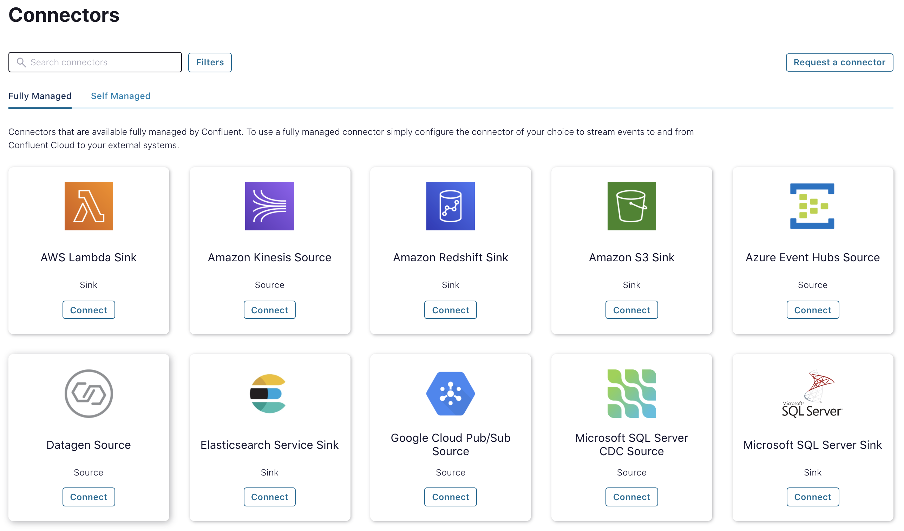
</div>

2. Enter the following configuration details. The remaining fields can be left blank.

<div align="center">

| setting                            | value                        |
|------------------------------------|------------------------------|
| name                               | DatagenSourceConnector_Users |
| api key                            | [*from step 5* ](#step-5)    |
| api secret                         | [*from step 5* ](#step-5)    |
| topic                              | users_topic                  |
| output message format              | JSON                         |
| quickstart                         | USERS                        |
| max interval between messages (ms) | 1000                         |
| tasks                              | 1                            |
</div>

<br>

3. Click on **Next**.
4. Before launching the connector, you should see something similar to the following. If everything looks similar, select **Launch**. 

<div align="center" padding=25px>
    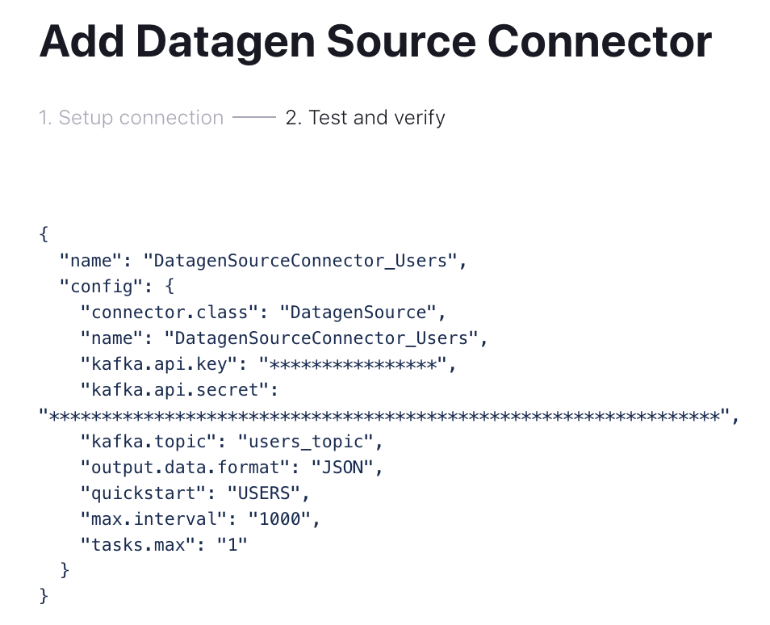
</div>

5. Next, create the second connector that will send data to **stocks_topic**. Click on **+ Add Connector** and then the **datagen Source** icon again. 

6. Enter the following configuration details. The remaining fields can be left blank. 

<div align="center">

| setting                            | value                        |
|------------------------------------|------------------------------|
| name                               | DatagenSourceConnector_Stocks|
| api key                            | [*from step 5* ](#step-5)    |
| api secret                         | [*from step 5* ](#step-5)    |
| topic                              | stocks_topic                 |
| output message format              | JSON                         |
| quickstart                         | STOCKS                       |
| max interval between messages (ms) | 1000                         |
| tasks                              | 1                            |
</div>

<br> 

7. Review the output again and then select **Launch**.

> **Note:** It may take a few moments for the connectors to launch. Check the status and when both are ready, the status should show *running*. <br> <div align="center">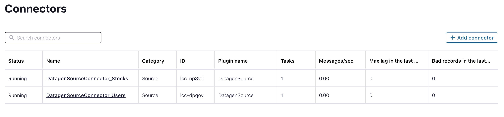</div>

> **Note:** If the connectors fails, there are a few different ways to troubleshoot the error:
> * Click on the *Connector Name*. You will see a play and pause button on this page. Click on the play button.
> * Click on the *Connector Name*, go to *Settings*, and re-enter your API key and secret. Double check there are no extra spaces at the beginning or end of the key and secret that you may have accidentally copied and pasted.
> * If neither of these steps work, try creating another Datagen connector.


9. You can view the sample data flowing into topics in real time. Navigate to  the **Topics** tab and then click on the **users_topic**. You can view the production and consumption throughput metrics here.

<div align="center">
    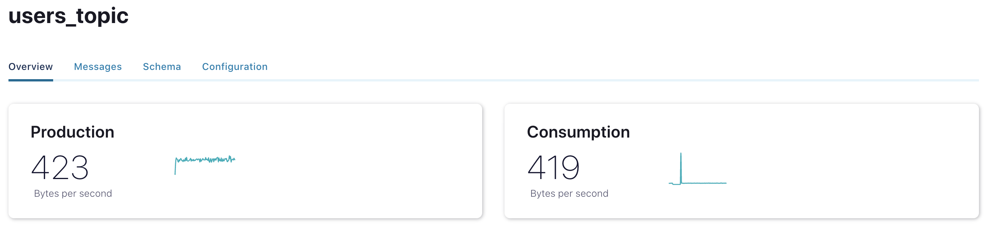
</div>

10. Click on **Messages**. In the search bar, select **Jump to Offset** from the drop-down, set the offset to **0**, and then execute the search. 

* You should now be able to see the messages within the UI. You can toggle between the table and payload views of the events by clicking the following buttons. 

<div align="center">
    
</div> 

* The messages should look something like the following. 

<div align="center">
    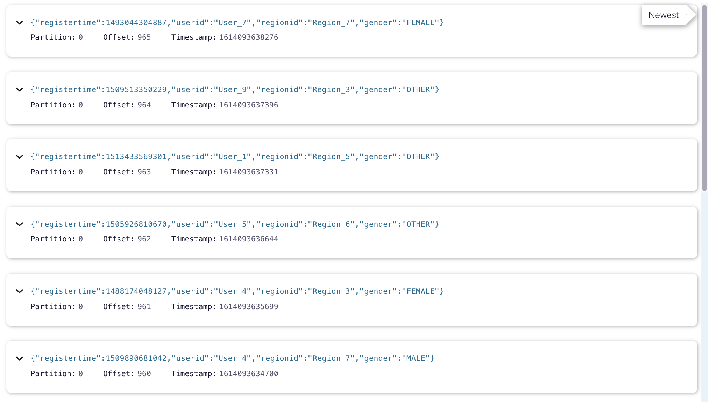
</div>


***

## <a name="step-6"></a>Create a ksqlDB Application

1. On the navigation menu, select **ksqlDB** and click **Create Application Myself**. 
2. Select **Global Access** and then **Continue**.
3. Name you ksqlDB application and set the streaming units to **4**. Click **Launch Application!**

> **Note:** A Confluent Streaming Unit is the unit of pricing for Confluent Cloud ksqlDB. A CSU is an abstract unit that represents the size of your kSQL cluster and scales linearly. 

<div align="center" padding=25px>
    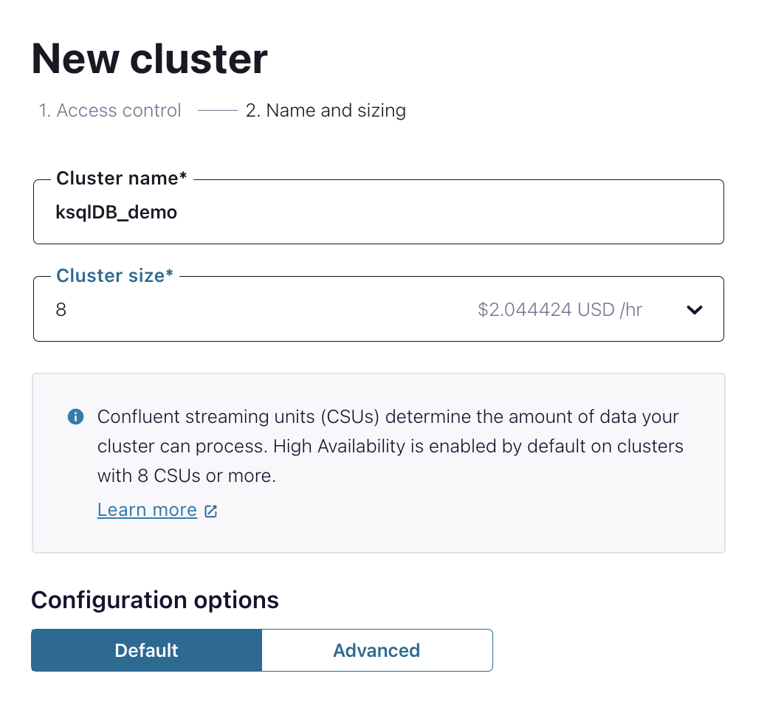
</div>

***

## <a name="step-7"></a>Create a Stream and a Table

Now that you are producing a continuous stream of data to **users_topic** and **stocks_topic**, you will use ksqlDB to understand the data better by performing continuous transformations, masking certain fields, and creating new derived topics with the enriched data.

You will start by creating a stream and table, which will be the foundation for your transformations in the upcoming steps.

A *stream* provides immutable data. It is append only for new events; existing events cannot be changed. Streams are persistent, durable, and fault tolerant. Events in a stream can be keyed.

A *table* provides mutable data. New events—rows—can be inserted, and existing rows can be updated and deleted. Like streams, tables are persistent, durable, and fault tolerant. A table behaves much like an RDBMS materialized view because it is being changed automatically as soon as any of its input streams or tables change, rather than letting you directly run insert, update, or delete operations against it.

To learn more about *streams* and *tables*, the following resources are recommended:
- [Streams and Tables in Apache Kafka: A Primer](https://www.confluent.io/blog/kafka-streams-tables-part-1-event-streaming/)
- [ksqlDB: Data Definition](https://docs.ksqldb.io/en/latest/reference/sql/data-definition/)

<br>

1. Navigate back to the **ksqlDB** tab and click on your application name. This will bring us to the ksqlDB editor. 

> **Note:** You can interact with ksqlDB through the **Editor**. You can create a stream by using the `CREATE STREAM` statement and a table using the `CREATE TABLE` statement. <br><br>To write streaming queries against **users_topic** and **stocks_topic**, you will need to register the topics with ksqlDB as a stream and/or table. 

2. First, create a **Stream** by registering the **stocks_topic** as a stream called **stocks_stream**. 

```sql
CREATE STREAM stocks_stream (
    side varchar, 
    quantity int, 
    symbol varchar, 
    price int, 
    account varchar, 
    userid varchar
) 
WITH (kafka_topic='stocks_topic', value_format='JSON');
```

3. Next, go to the **Streams** tab at the top and click on **STOCKS_STREAM**. This provides information on the stream, output topic (including replication, partitions, and key and value serialization), and schemas.

<div align="center">
    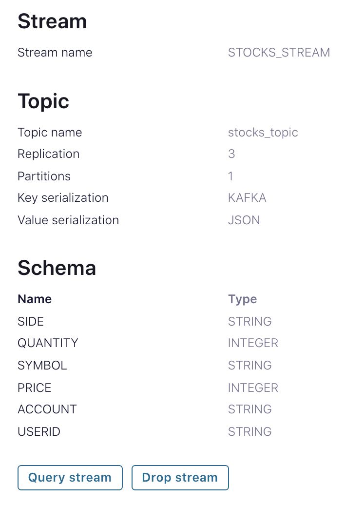
</div>

4. Click on **Query Stream** which will take you back to the **Editor**. You will see the following query auto-populated in the editor which may be already running by default. If not, click on **Run query**. To see data already in the topic, you can set the `auto.offset.reset=earliest` property before clicking **Run query**. <br> <br> Optionally, you can navigate to the editor and construct the select statement on your own, which should look like the following.

```sql
SELECT * FROM STOCKS_STREAM EMIT CHANGES;
```

5. You should see the following data within your **STOCKS_STREAM** stream.

<div align="center">
    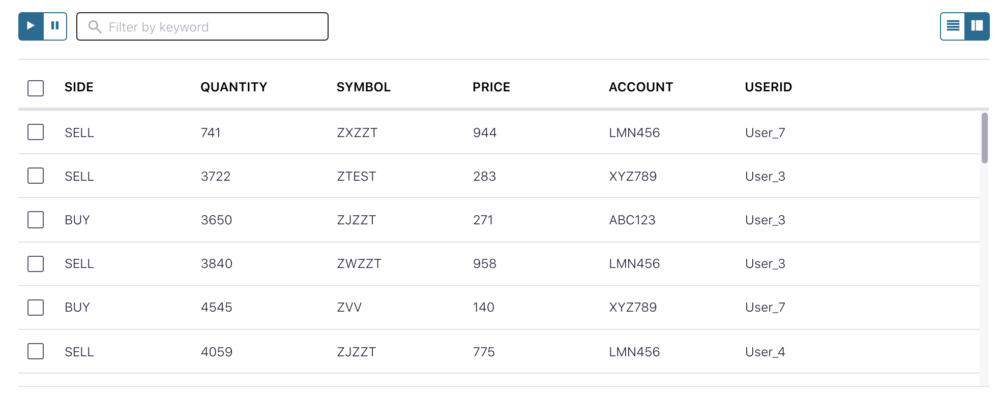
</div>

6. Click **Stop**. 
7. Next, create a **Table** by registering the **users_topic** as a table named **users**. Copy the following code into the **Editor** and click **Run**. 

```sql
CREATE TABLE users (
    userid varchar PRIMARY KEY, 
    registertime bigint, 
    gender varchar, 
    regionid varchar
) 
WITH (KAFKA_TOPIC='users_topic', VALUE_FORMAT='JSON');
```

8. Once you have created the **USERS** table, repeat what you did above with **STOCKS_STREAMS** and query the **USERS** table. This time, select the **Tables** tab and then select the **USERS** table. You can also set the `auto.offset.reset=earliest`. Like above, if you prefer to construct the statement on your own, make sure it looks like the following. 

```sql
SELECT * FROM USERS EMIT CHANGES;
```

 * You should see the following data in the messages output.

<div align="center">
    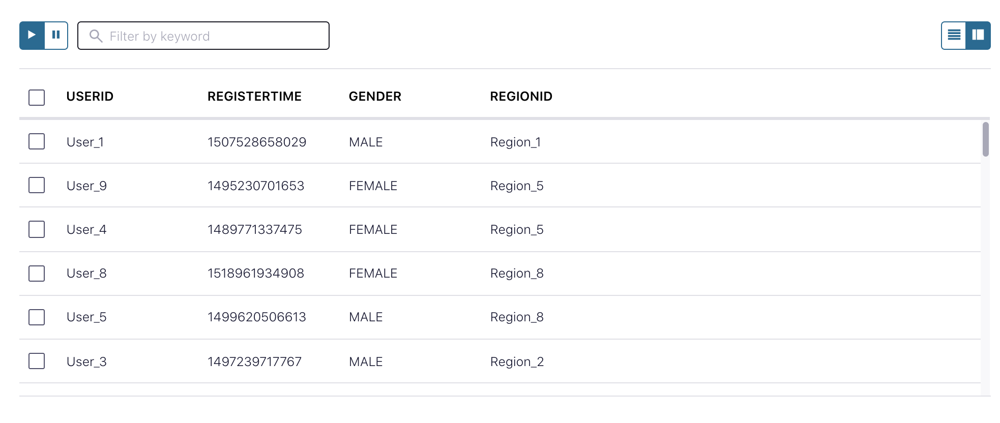
</div>

> **Note:** Note: If the output does not show up immediately, you may have done everything correctly and it just needs a moment. Setting `auto.offset.reset=earliest` also helps output data faster since the messages are already in the topics.

9. Stop the query by clicking **Stop**. 

***

## <a name="step-8"></a>**Stream Governance**

1. Stream Governance is built on 3 key strategic pillars: Stream lineage,Stream Catalog and Stream quality. This can be enabled by going to schema registry tab in the navigation:

<div align="center">
    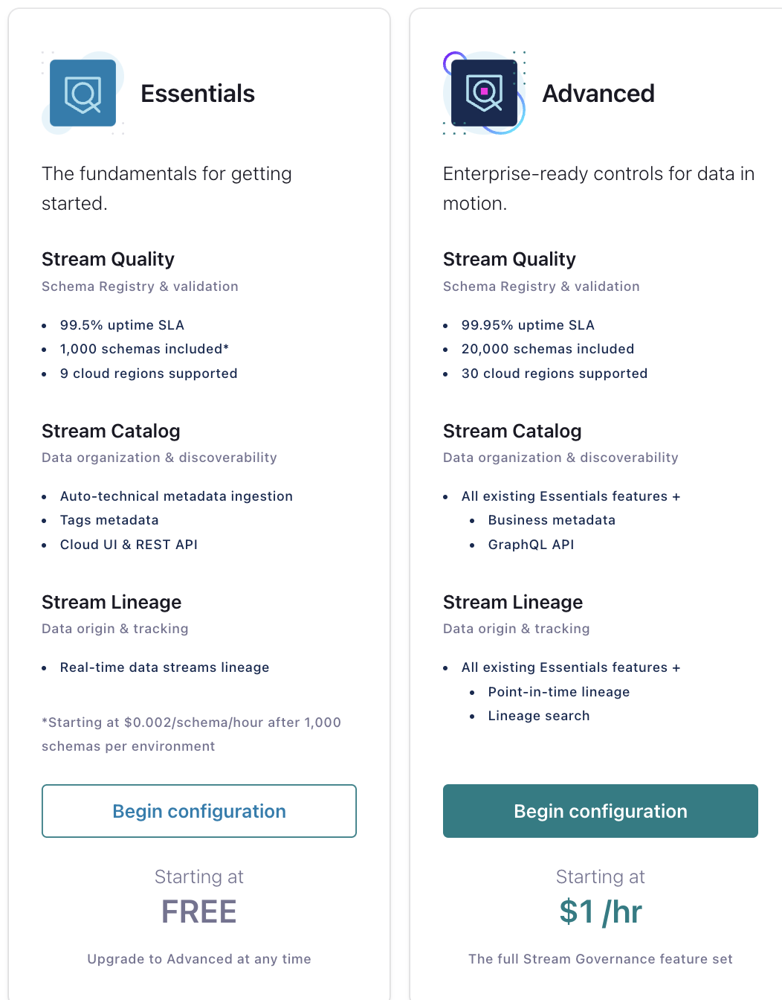
</div>

2. Select the Essentials and Begin Configuration. It takes you to the below screen where you select your cloud provider and the region.

<div align="center">
    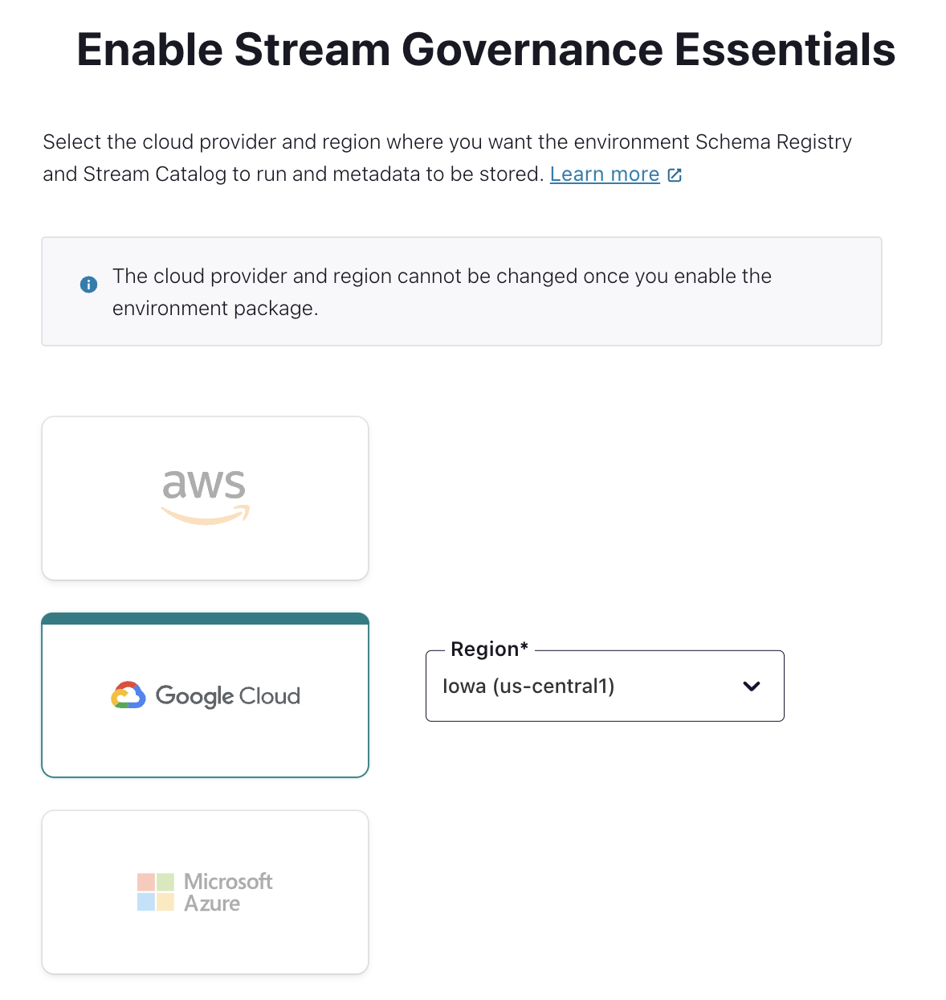
</div>


3. Navigate to Stream Lineage in the navigation. Stream lineage is used to understand complex data relationships and uncover more insights with interactive, end-to-end maps of event streams. Below screenshot shows the current streams we created in the earlier section.

<div align="center">
    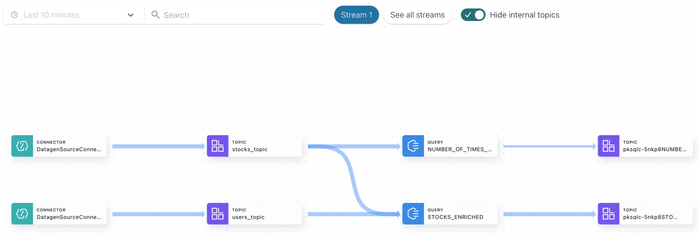
</div>

4. Navigate to Stream Catalog on the top right corner of the Web UI as show below and demo the search capabilities.

<div align="center">
    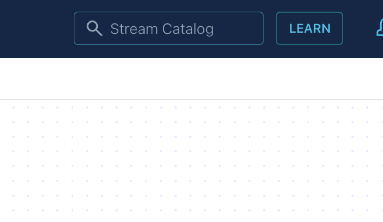
</div>

5. Navigate to Schema Registry on the navigation pane:

Confluent Cloud Schema Registry is used to manage schemas and it defines a scope in which schemas can evolve. It stores a versioned history of all schemas, provides multiple compatibility settings, and allows schemas to evolve according to these compatibility settings. It is also fully-managed.

A topic contains messages, and each message is a key-value pair. The message key or the message value (or both) can be serialized as JSON, Avro, or Protobuf. A schema defines the structure of the data format. 

We will get back to this section later in the demo where we can go through the schemas, Schema Evolution, versions and such.

## <a name="step-9"></a>**End-to-End cloud ETL deployment, built for 100% cloud services**


Let’s say you have a database such as RDS, or object storage such as AWS S3, or a data warehouse such as Redshift. How do you connect these data systems to your architecture?

There are 2 options: <br>

1. Develop your own connectors using the Kafka Connect framework (this requires a lot of development time and effort).  
2. You can leverage the 200+ connectors Confluent offers out-of-the-box which allows you to configure your sources and sinks in a few, simple steps. To view the complete list of connectors that Confluent offers, please see [Confluent Hub](https://www.confluent.io/hub/).

With Confluent’s connectors, your data systems can communicate with your services, completing your data pipeline. 

If you want to run a connector not yet available as fully-managed in Confluent Cloud, you may run it yourself in a self-managed Connect cluster and connect it to Confluent Cloud. Please note that Confluent will still support any self managed components. 

Now that you have completed setting up your Confluent Cloud account, cluster, topic, and Schema Registry, this next step will guide you how to build end to end pipelines 

Instruction Available here: https://docs.confluent.io/platform/current/tutorials/examples/cloud-etl/docs/index.html

1. Update the demo.cfg file to reflect export DATA_SOURCE='rds'
2. export AWS_PROFILE=default
3. profile must exist in ~/.aws/credentials

## <a name="step-10"></a>**Monitor Confluent Cloud with Datadog**

Instructions here: https://docs.datadoghq.com/integrations/confluent_cloud/

## <a name="step-11"></a>Clean Up Resources

Deleting the resources you created during this workshop will prevent you from incurring additional charges. 

1. The first item to delete is the ksqlDB application. Select the **Delete** button under **Actions** and enter the **Application Name** to confirm the deletion. 

<div align="center">
    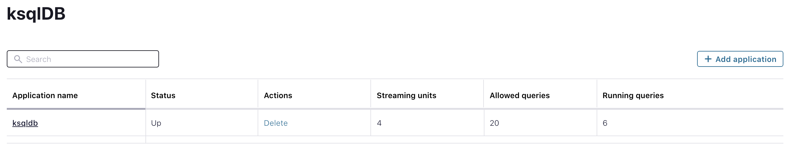
</div>

2. Next, delete the Datagen Source connectors for **users** and **stocks**. Navigate to the **Connectors** tab and select each connector. In the top right corner, you will see a **trash** icon. Click the icon and enter the **Connector Name**. Delete both the **users** and **stocks** connectors. 

<div align="center">
    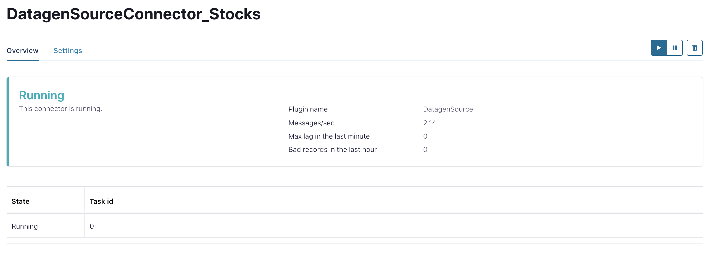
</div>

3. Finally, under **Cluster Settings**, select the **Delete Cluster** button at the bottom. Enter the **Cluster Name** and select **Confirm**. 

<div align="center">
    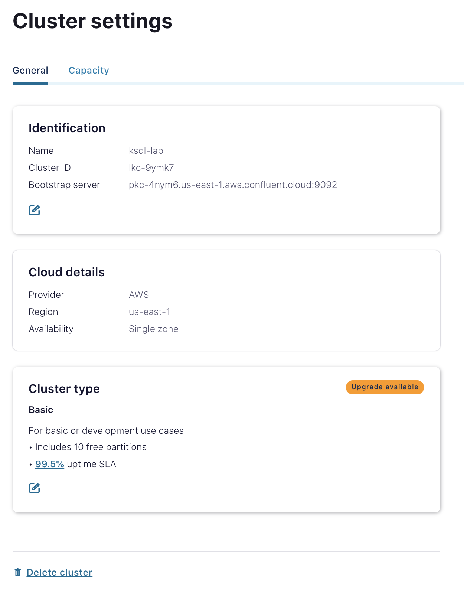
</div>

*** 

## <a name="step-12"></a>Confluent Resources and Further Testing

Here are some links to check out if you are interested in further testing:
- [Message Ordering and Delivery Guanrantees](https://developer.confluent.io/tutorials/message-ordering/kafka.html)
- [Leveraging terraform](https://registry.terraform.io/providers/confluentinc/confluent/latest/docs/resources/confluent_kafka_topic/)
- [Delivery Semantics](https://docs.confluent.io/kafka/design/delivery-semantics.html)
- [Confluent Cloud Documentation](https://docs.confluent.io/cloud/current/overview.html)
- [Best Practices for Developing Apache Kafka Applications on Confluent Cloud](https://assets.confluent.io/m/14397e757459a58d/original/20200205-WP-Best_Practices_for_Developing_Apache_Kafka_Applications_on_Confluent_Cloud.pdf)

***

